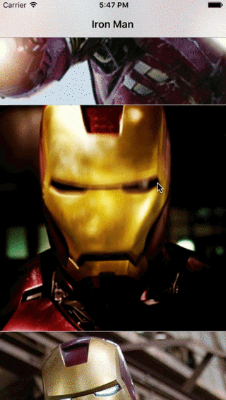
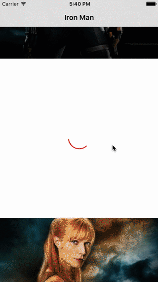
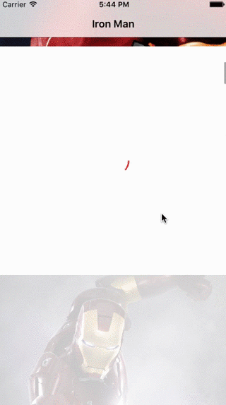

<p align="center">
  
</p>
# Saffron
[](https://github.com/Carthage/Carthage)
[](https://travis-ci.org/CaptainTeemo/Saffron)
[](https://codecov.io/github/CaptainTeemo/Saffron?branch=master)
[](https://raw.githubusercontent.com/CaptainTeemo/Saffron/master/LICENSE.md)
[](https://github.com/CaptainTeemo/Saffron/releases)

Saffron is a framework that gives a helping hand to download images and manage caches.

### Features
* Generic Cache struct that can cache everything.
* Convenient extensions for UIImageView do download and cache work for you.
* Built in loading animator which can be configured.
* GIF image support.
* Easy to use.

### At a glance
```swift
imageView.sf_setImage(#some image url string#)
```
That's all!

##### Cache
```swift
var stringCache = Cache<String>(cacheDirectoryPath: cachePath)
stringCache.write(key, value: value)

let cachedString = stringCache.fetch(key)
```


##### GIF image support



##### Circle reveal animation
```swift
func whereImageViewShouldBeInitialized() {
    let loader = DefaultAnimator(revealStyle: .Circle, reportProgress: false)
    imageView.sf_setAnimationLoader(loader)
}
```


##### Fade reveal animation
```swift
func whereImageViewShouldBeInitialized() {
    let loader = DefaultAnimator(revealStyle: .Fade, reportProgress: false)
    imageView.sf_setAnimationLoader(loader)
}
```



##### Report download progress
```swift
func whereImageViewShouldBeInitialized() {
    let loader = DefaultAnimator(revealStyle: .Fade, reportProgress: true)
    imageView.sf_setAnimationLoader(loader)
}
```



### Requirements
* iOS 8.0+
* Xcode 7.3+

### Carthage
Put `github "CaptainTeemo/Saffron"` in your cartfile and run `carthage update` from terminal, then drag built framework to you project.
